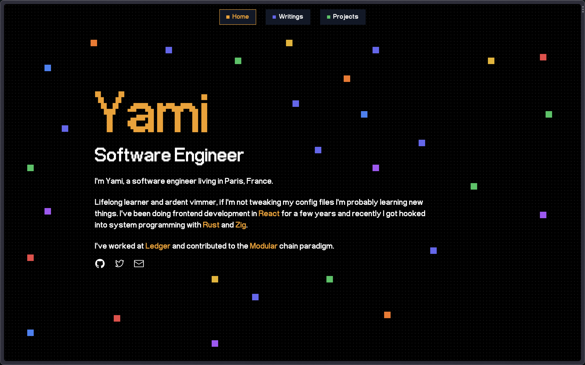

# Yami's Personal Website

    
    
    

### Stack

- [Astro](https://astro.build/): A modern static site builder
- [TailwindCSS](https://tailwindcss.com/): A utility-first CSS framework
- [Vercel](https://vercel.com/): A cloud hosting platform

### LICENSE

MIT License

You are free to reuse and adapt this website to your needs if you provide a visible link to my website [https://yami.sh](https://yami.sh) as a form of attribution.

Check out [LICENSE](./LICENSE) for more details.
